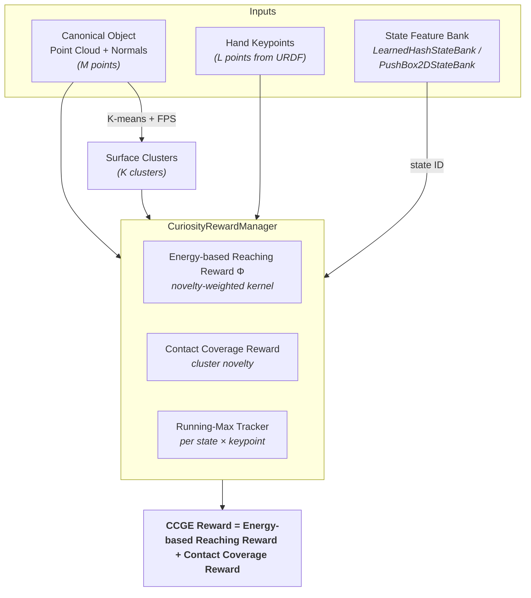

<div align="center">

<h1>ContactExplorer</h1>

  <p>
    <a href="https://contact-coverage-guided-exploration.github.io/"></a>
    <a href="https://www.youtube.com/watch?v=NfZVJNBX1Uc"></a>
    <a href="https://arxiv.org/pdf/2603.10971"></a>
    <a href="https://github.com/ruoyiqiao/ContactExplorer/stargazers"></a>
  </p>

  <p>
    <a href="https://developer.nvidia.com/isaac-gym"></a>
    <a href="https://ubuntu.com/blog/tag/22-04-lts"></a>
    
  </p>

  <p align="center">
    
    
    
    
  </p>

</div>


## Highlights

**ContactExplorer** is a exploration method for dexterous manipulation. It defines contact as the intersection between object surface points and hand keypoints, and maintains a hash-conditioned counter of *which fingers touch which object regions*.

- **Coverage reward** (count-based) rewards novel contact patterns.
- **Reaching reward** (energy-based) steers the hand toward under-explored regions.
- **Results:** faster training and higher success on singulation, retrieval, in-hand reorientation, and bimanual tasks — with sim-to-real transfer. See the [paper](https://arxiv.org/pdf/2603.10971).

## 📚 Table of Contents

1. **[Overview](#overview)**
2. **[Installation](#installation)**
   - [IsaacGym Conda Env](#isaacgym-conda-env)
   - [Install IsaacGym](#install-isaacgym)
   - [Install Other Dependencies](#install-other-dependencies)
3. **[Training and Evaluation](#training-and-evaluation)**
   - [Training Scripts](#training-scripts)
   - [Evaluation](#evaluation)
   - [Observation and Action Spaces](#observation-and-action-spaces)
   - [Reward Settings (`reward_type`)](#reward-settings-reward_type)
4. **[Repository Structure](#repository-structure)**
5. **[CCGE Reward Architecture](#ccge-reward-architecture)**
6. **[Citation](#citation)**
7. **[License](#license)**


# Installation


## IsaacGym Conda Env

```bash
conda create -n ccge python=3.8   # mamba also works
conda activate ccge
```

### Install IsaacGym

Download [IsaacGym](https://developer.nvidia.com/isaac-gym/download) and extract:

```bash
wget https://developer.nvidia.com/isaac-gym-preview-4
tar -xvzf isaac-gym-preview-4
```

Install IsaacGym Python API:

```bash
pip install -e isaacgym/python
```

Test installation:

```bash
python 1080_balls_of_solitude.py  # or
python joint_monkey.py
```

For libpython error:

- Check conda path:
    ```bash
    conda info -e
    ```
- Set LD_LIBRARY_PATH:
    ```bash
    export LD_LIBRARY_PATH=</path/to/conda/envs/your_env/lib>:$LD_LIBRARY_PATH
    ```

### Install Other Dependencies

Install [IsaacGymEnvs](https://github.com/isaac-sim/IsaacGymEnvs) and following dependencies:

```bash
pip install --no-build-isolation -r requirements.txt
```

# Training and Evaluation

## Training Scripts

Two types of dexterous hands are provided (LEAP and Allegro). You may choose one of them to train.

| Task | Training Script |
|------|----------------|
| Singulation | `train_<hand_type>_singulation.sh` |
| Table Top | `train_<hand_type>_table_top.sh` |
| Inhand | `train_<hand_type>_inhand.sh` |
| Retri | `train_<hand_type>_cube_in_box.sh` |
| Bimanual | `train_bimanual.sh` |


## Evaluation


Set `mode=eval` and point to a trained run directory. Start from the corresponding `train_*.sh` and append the eval flags:

```bash
python src/train.py \
    mode=eval \
    task=<TaskName> \
    train=<TrainCfgName> \
    ... \
    --model_dir=logs/PPO/<run_dir> \
    --resume_iter=<checkpoint_iter> \
    --eval_times=5 \
    --vis_env_num=0
```

Notes:
- `--model_dir` is required for evaluation and should contain `model_*.pt`.
- `--resume_iter` is optional (defaults to the latest checkpoint).


## Observation and Action Spaces

Observation and action spaces are set via Hydra overrides in launch scripts:

```bash
obs_space="['allegro_hand_dof_position']"
action_space="['wrist_translation','wrist_rotation','hand_rotation']"
```

Available keys are task-specific — see the corresponding file in `src/tasks/`.

## Reward Settings (`reward_type`)

Training scripts pass a `reward_type` string to `src/train.py`, e.g.:

- `reward_type="target+bonus+success+reach+energy_reach+contact_coverage"`

The **CCGE** exploration signal consists of `energy_reach` and `contact_coverage`. To ablate exploration, remove them:

- `reward_type="target+bonus+success+reach"`


# Repository Structure

- `src/` — core library code
  - `tasks/` — Isaac Gym task environments, reward logic, and curiosity modules
  - `algorithms/` — PPO and intrinsic-reward components
  - `utils/` — config loading, logging, helpers
  - Entry points: `train.py`
- `cfg/` — Hydra configs
  - `task/` — task/environment configs
  - `train/` — training configs

# CCGE Reward Architecture



### Required Data

Each task must supply these tensors per step (N = num envs, L = keypoints, M = object points):

| Tensor | Shape | How to get it |
|--------|-------|---------------|
| `keypoint_positions_with_offset` | `(N, L, 3)` | Index rigid-body states by keypoint link indices, apply local offsets via `quat_apply` |
| `keypoint_contact_mask` | `(N, L)` bool | `(dist_to_surface < threshold) & (contact_force > threshold)` |
| `object_root_positions` | `(N, 3)` | From `root_states` |
| `object_root_orientations` | `(N, 4)` | From `root_states` (xyzw quaternion) |
| Canonical point cloud | `(M, 3)` | Loaded from dataset (object frame) |
| Canonical normals | `(M, 3)` | Loaded from dataset |

For the full step-by-step integration guide (keypoint setup, contact mask, `CuriosityRewardManager` init, reward computation, reset handling, and config), see [`src/tasks/README.md`](src/tasks/README.md#step-by-step).

# Acknowledgments
This repository builds upon or incorporates code from the following open-source projects:

- [UniDexFPM](https://github.com/tianhaowuhz/UniDexFPM) for hand-arm task environments.
- [IsaacGymEnvs](https://github.com/isaac-sim/IsaacGymEnvs) for base task environments and Isaac Gym utilities.
- [WoCoCo](http://github.com/LeCAR-Lab/wococo) for intrinsic baseline implementation references.
- [ARCTIC](https://github.com/zc-alexfan/arctic) and [ContactDB](https://github.com/samarth-robo/contactdb_prediction) for simulation assets.

Please refer to the respective repositories and their licenses for more details.

# Citation
If you find our work useful, please consider citing us!

```
@article{liu2026contactcoverageguidedexplorationgeneralpurpose,
      title={Contact Coverage-Guided Exploration for General-Purpose Dexterous Manipulation}, 
      author={Zixuan Liu and Ruoyi Qiao and Chenrui Tie and Xuanwei Liu and Yunfan Lou and Chongkai Gao and Zhixuan Xu and Lin Shao},
      year={2026},
      journal={arXiv preprint arXiv:2603.10971},
}
```

## License

This project is licensed under the MIT License - see the [LICENSE](LICENSE) file for details.
